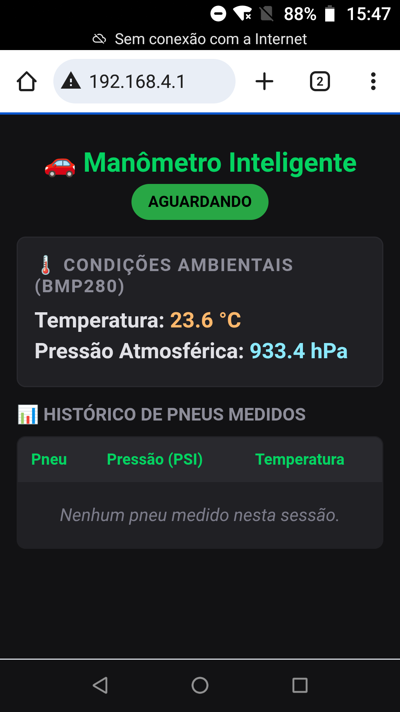
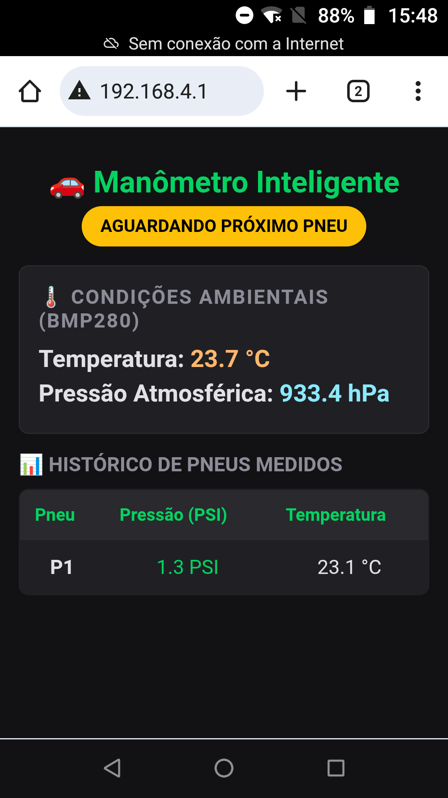

# PROJETO INTEGRADOR III
## Manômetro para Pneus

Autor: Julio C L Ribeiro  

### 🔑 Características principais  
* **Leituras de Pressão individualizadas:** Leitura da pressão de mais de um pneu, com dados individualizados na tela, levando em consideração as devidas compensações de temperatura e pressão ambiente.
* **Conectividade Sem Fio:** Envio dos dados coletados para dispositivos móveis conectados via Wi-Fi própria dispensando internet.
* **Respeito a biblioteca fornecida:** Modificamos apenas os arquivos main.cpp e o CMakeList.txt para a compilação. Obs.: Uma única modificação em displaySSD1306.c foi para inverter o preto/branco.

### 📱 Telas mostradas no dispositivo móvel

Exemplo de telas exibidas em um celular celular conectado, durante os principais estados:

| Aguardando Leituras | Leituras Concluídas |
| :---: | :---: |
|    *Aguardando conexão com os sensores* |    *Dados de pressão atualizados* |

---

[Clique aqui para ver o código fonte deste projeto](https://github.com/jukaribeiro/Projeto-Integrador-3)

[Clique aqui para ver o Vídeo deste projeto](https://youtu.be/7gpSlrYxqJQ)

| Estado | Comportamento do LED |
|--------|----------------------|
| `AMBIENTE` | Pisca lento (100ms ligado / 1900ms desligado) |
| `AGUARDANDO_PNEU` | Pisca médio (200ms ligado / 800ms desligado) |
| `MEDINDO_PNEU` | Acesso fixo enquanto mede |

---

### 🌐 Acesso ao Servidor Web

1. Conecte o celular à rede Wi-Fi **`PROJETO`** (aberta, sem senha)
2. Acesse o endereço: **`http://192.168.4.1`**
3. A página atualiza automaticamente a cada 2 segundos

**Informações exibidas na página web:**
- Badge de status colorido (verde/amarelo/vermelho)
- Temperatura e pressão ambiente (BMP280)
- Tabela com histórico de todos os pneus medidos (PSI e °C)
- Destaque amarelo no pneu em medição ativa

---

### 📌 Constantes de Configuração

| Constante | Valor | Descrição |
|-----------|-------|-----------|
| `PRESSAO_LIMIAR_CONEXAO_KPA` | 3.0 | Pressão manométrica mínima para detectar conexão do bico |
| `PRESSAO_LIMIAR_DESCONEXAO_KPA` | 1.0 | Pressão abaixo da qual se considera desconectado |
| `TEMPO_DESCONEXAO_MS` | 500 | Tempo de filtro para confirmar desconexão (evita falsos disparos) |
| `MAX_PNEUS` | 10 | Número máximo de pneus por ciclo de medição |